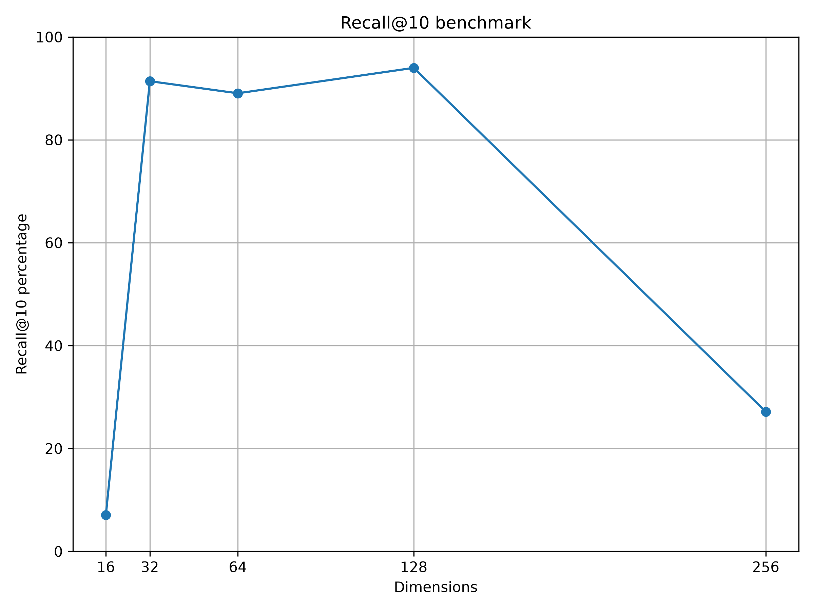

# Vamana-AVX
From-scratch end-to-end implementation of the Vamana vector search algorithm (more specifically [DiskANN](https://milvus.io/blog/diskann-explained.md)) grew out from the original goal of learning [AVX-intrinsics](https://www.intel.com/content/www/us/en/docs/intrinsics-guide/index.html) programming (and a bit of under the hood ML algorithms) on CPU.

The pipeline was design to squeeze as much capabilities of CPU as possible. The main core DiskANN-related logic (product quantizations, building graph indexes and searching) was executed in a parallelized manner in multi-threaded MPI environments using OpenMP threadpools.

## Checklist
- [x] Doing metric computations with SIMD extensions.
- [x] Creating a custom (and simple) data serialization of `.vecf` (again, this is not an established format, but just our own one)
    - [x] Make our own data generator and serialize it to `.vecf`
    - [x] Make a `.vecf` data sharding for encoding purposes.
- [x] Create queries and associated ground truths on the generated datasets for benchmarking.
- [x] Creating our own custom [product quantization](https://towardsdatascience.com/similarity-search-product-quantization-b2a1a6397701/) (of FP32s) scheme and codebooks (serialized format extensions of `.pqbook` for codebooks and `.pqbin` for encodings)
- [x] Make our own PQ codebook training algorithm.
- [x] Encode data shards using trained codebooks.
- [x] Create indexing formats to be used for searching.
- [x] Building index for Vamana graph search.
- [x] Writing a (distributed) Vamana graph search algorithm on our custom data (MPI, OpenMP alongside `io_uring` for beam width batch and reranking).
- [x] Benchmark the pipeline's _recall@k_ scores.
- [ ] (Optional) Observe the searching program with eBPF through Rust Aya.
- [ ] (Optional) Currently work with only L2 metric implementation, it would be great to expand to other metrics (cosine, L1, etc.)

## Results and findings

Overall, doing this really show case the Curse of Dimensionality effect. Although one unexpected thing coming out from this is that too low of a dimension count can also negatively affect the product-quantization performance. In hindsight, full-precision search is totally feasible and is a better choice for these low-dimensional cases. See `results/` for more on the precision of the pipeline.

## Requirements
- C
- Python
- Rust
- [Spack](https://spack.io/) for seamless MPI installation, see `environments/spack.yaml` for all Spack-related packages for all of HPC-related setups.
